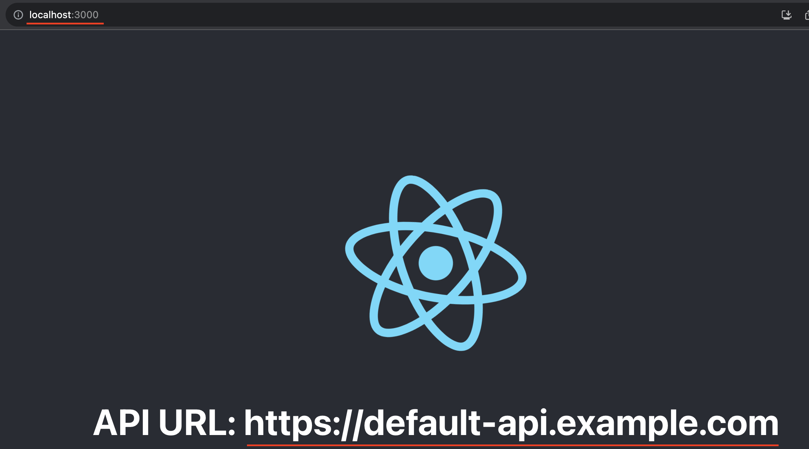
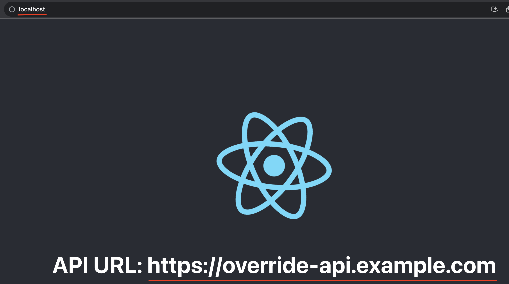

# Override .env variables when building a Docker container

This guide explains how to set up a React app with Docker and Nginx, along with the ability to override environment variables during the build process.

## Project Structure

Here's how the project structure might look like:

```
my-react-app/
├── .env
├── Dockerfile
├── docker-compose.yml
├── nginx.conf
└── src/
    └── ...
```

## Steps

### 1. Create a `.env` File

Create a `.env` file in the root directory of your React app to store default environment variables.

```env
# .env
REACT_APP_API_URL=https://default-api.example.com
```

### 2. Create a `Dockerfile`

Create a `Dockerfile` in the root directory with the following content:

```Dockerfile
# Use an official Node runtime as a parent image
FROM node:14 as build

# Set the working directory in the container
WORKDIR /app

# Copy package.json and package-lock.json
COPY package*.json ./

# Install dependencies
RUN npm install

# Copy the current directory contents into the container
COPY . .

# Build the React app with overridden environment variables
ARG REACT_APP_API_URL
ENV REACT_APP_API_URL=$REACT_APP_API_URL

RUN npm run build

# Use Nginx for serving the build
FROM nginx:alpine

# Copy Nginx configuration
COPY nginx.conf /etc/nginx/conf.d/default.conf

# Copy build files from build stage
COPY --from=build /app/build /usr/share/nginx/html

# Expose port 80
EXPOSE 80

# Start Nginx server
CMD ["nginx", "-g", "daemon off;"]
```

### 3. Create a `docker-compose.yml` File

Create a `docker-compose.yml` file in the root directory:

```yaml
version: '3'
services:
  web:
    build: 
      context: .
      args:
        # REACT_APP_API_URL must be set in an environment variable
        # example: export REACT_APP_API_URL=https://override-api.example.com
        REACT_APP_API_URL: ${REACT_APP_API_URL}
    ports:
      - "80:80"
```

### 4. Create an `nginx.conf` File

Create an `nginx.conf` file for Nginx configuration:

```nginx
server {
  listen 80;

  location / {
    root /usr/share/nginx/html;
    index index.html index.htm;
    try_files $uri $uri/ /index.html;
  }

  error_page   500 502 503 504  /50x.html;
    location = /50x.html {
        root   /usr/share/nginx/html;
  }
}
```

### 5. Build and Run the Docker Container

To build and run the Docker container, you can use the following commands:

```bash
# Build the Docker image
docker-compose build

# Run the Docker container
docker-compose up -d
```

This will build your React app with the overridden `.env` variable (`REACT_APP_API_URL`) and run it in a Docker container served by Nginx.

### Result

REACT_APP_API_URL running the app locally:
<p align="center">
  
</p>

REACT_APP_API_URL running the app in the container:
<p align="center">
  
</p>